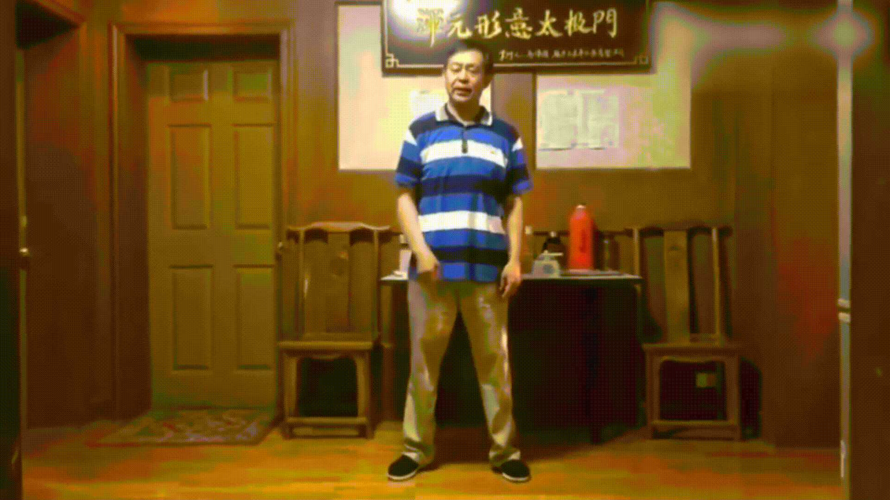
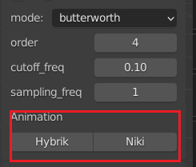

<!-- omit in toc -->
# Vid2Anim Creator

欢迎使用 Vid2Anim Creator，本插件可以从视频中提取角色动画

<br />

<p align="center">
  <a href="https://github.com/Margaret-Chen217/Vid2Anim_Creator/release/latest">
    
  </a>

  <h3 align="center">视频提取角色动作</h3>
  <p align="center">
    效果良好的动作捕捉，快速开始你的项目！
    <br />
    <a href="https://github.com/shaojintian/Best_README_template"><strong>下载Release版本 »</strong></a>
    <br />
  </p>

</p>

## 目录

- [目录](#目录)
  - [版本要求](#版本要求)
  - [**使用步骤**](#使用步骤)
    - [安装插件](#安装插件)
    - [配置运行环境](#配置运行环境)
    - [生成角色动画](#生成角色动画)
    - [重定向至其他模型](#重定向至其他模型)
  - [文件目录说明](#文件目录说明)
  - [鸣谢](#鸣谢)

### 版本要求

Blender 3.3 LTS 或更新版本

### **使用步骤**

#### 安装插件

下载 [Release版本]()

点击 ```Preference -> Install ```选择```.zip```文件进行安装

#### 配置运行环境

```Preference```中找到安装好的插件

点击 ```Update Python Modules``` 安装并更新Python依赖环境


#### 生成角色动画

在```VIEW_3D```界面侧边栏打开**V2A Tool**

选择要进行提取的原视频```.mp4```文件


配置是否需要使用GPU进行处理，和是否需要开启降噪功能


本插件提供巴特沃斯，卷积平滑和高斯卷积三种降噪方式

选择降噪模式并设置对应参数


最后根据要使用的提取算法点击对应的按钮



#### 重定向至其他模型

待补全

### 文件目录说明

```
filetree 
│  config.py
│  executors.py
│  predict.py
│  preference.py
│  README.md
│  rotation_conversions.py
│  setup_utils.py
│  util.py
│  __init__.py
├─asset/
├─configs/
├─hybrik/
├─model_files
├─niki /
└─pretrained_models/

```


### 鸣谢


- [HybrIK](https://github.com/Jeff-sjtu/HybrIK)

- [NIKI](https://github.com/Jeff-sjtu/NIKI.git)
  
- [GitHub Emoji Cheat Sheet](https://www.webpagefx.com/tools/emoji-cheat-sheet)

- [blender_mmd_tools](https://github.com/UuuNyaa/blender_mmd_tools.git)

- [Best_README_template](https://github.com/shaojintian/Best_README_template.git)

- [SMPL_blender_addon](https://github.com/Meshcapade/SMPL_blender_addon)


<!-- links -->
[your-project-path]:shaojintian/Best_README_template
[contributors-shield]: https://img.shields.io/github/contributors/shaojintian/Best_README_template.svg?style=flat-square
[contributors-url]: https://github.com/shaojintian/Best_README_template/graphs/contributors
[forks-shield]: https://img.shields.io/github/forks/shaojintian/Best_README_template.svg?style=flat-square
[forks-url]: https://github.com/shaojintian/Best_README_template/network/members
[stars-shield]: https://img.shields.io/github/stars/shaojintian/Best_README_template.svg?style=flat-square
[stars-url]: https://github.com/shaojintian/Best_README_template/stargazers
[issues-shield]: https://img.shields.io/github/issues/shaojintian/Best_README_template.svg?style=flat-square
[issues-url]: https://img.shields.io/github/issues/shaojintian/Best_README_template.svg
[license-shield]: https://img.shields.io/github/license/shaojintian/Best_README_template.svg?style=flat-square
[license-url]: https://github.com/shaojintian/Best_README_template/blob/master/LICENSE.txt
[linkedin-shield]: https://img.shields.io/badge/-LinkedIn-black.svg?style=flat-square&logo=linkedin&colorB=555
[linkedin-url]: https://linkedin.com/in/shaojintian


