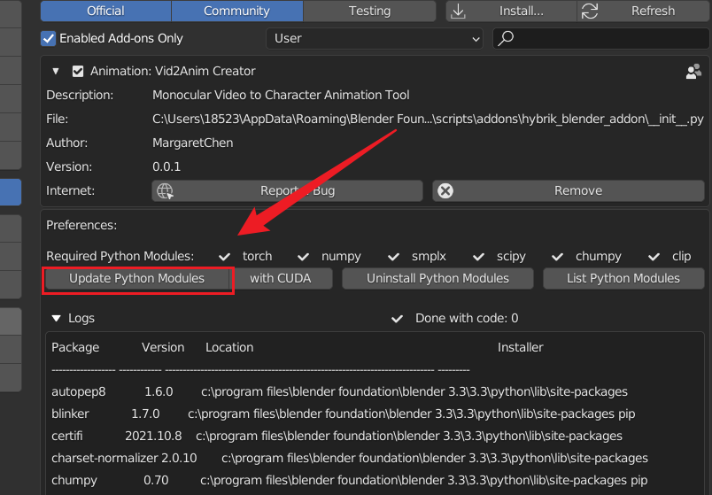
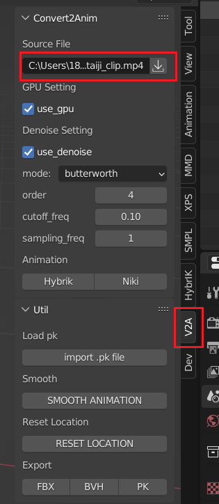
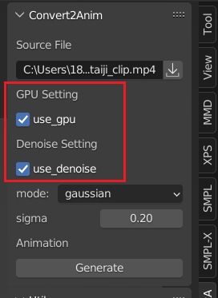
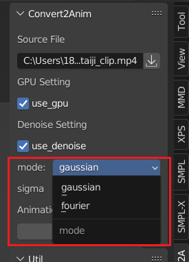
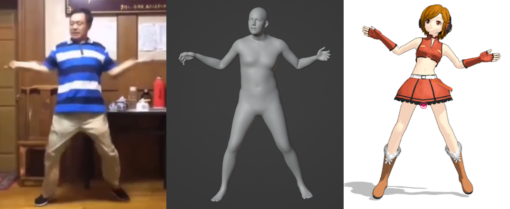
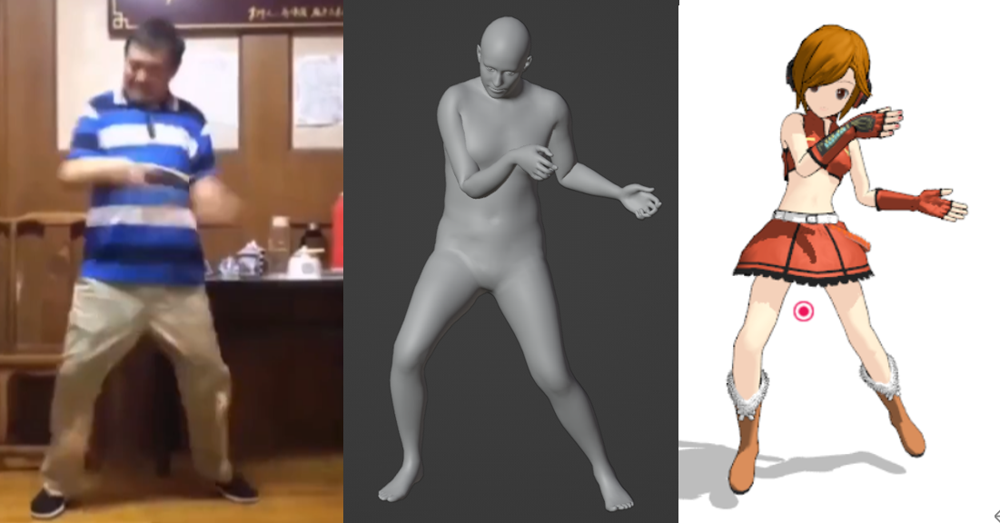

<!-- omit in toc -->
# Vid2Anim Creator

欢迎使用 Vid2Anim Creator，本插件可以从视频中提取角色姿态


<p align="center">
  <a href="https://github.com/Margaret-Chen217/Vid2Anim_Creator/release/latest">
    
  </a>

  <h3 align="center">视频提取角色姿态</h3>
  <p align="center">
    效果良好的动作捕捉，快速开始你的项目！
    <!-- <br />
    <a href="https://github.com/shaojintian/Best_README_template"><strong>下载Release版本 »</strong></a>
    <br /> -->
  </p>

</p>

## 目录

- [目录](#目录)
  - [兼容性](#兼容性)
  - [**使用步骤**](#使用步骤)
    - [安装插件](#安装插件)
    - [配置运行环境](#配置运行环境)
    - [生成角色动画](#生成角色动画)
    - [重定向至其他模型](#重定向至其他模型)
  - [文件目录说明](#文件目录说明)
  - [鸣谢](#鸣谢)

### 兼容性

Blender 3.3 LTS 或更新版本

Windows Only

### **使用步骤**

#### 安装插件

<!-- 下载 [Release版本]() -->

点击 ```Preference -> Install ```选择```.zip```文件进行安装

#### 配置运行环境

```Preference```中找到安装好的插件

点击 ```Update Python Modules``` 安装并更新Python依赖环境



WARNING: 若numpy版本高于1.24会自动进行降级，numpy=1.24与chumpy存在冲突

#### 生成角色动画

在```VIEW_3D```界面侧边栏打开**V2A Tool**

选择要进行提取的原视频```.mp4```文件



配置是否需要使用GPU进行处理，和是否需要开启降噪功能



本插件提供傅里叶降噪和高斯平滑两种降噪方式

选择降噪模式并设置对应参数



最后点击`Generate`生成角色动画


#### 重定向至其他模型

- 生成动画后选择导出BVH格式

- BVH格式重定向至其他模型，以MMD为例：

  - Blender导入.bvh文件，骨骼旋转方式设置为四元数
  - 下载 [SMPLX-MMD骨骼名称对照|Google Drive](https://drive.google.com/file/d/1-QW4lxPNFdmRwSkd4_U5GWoX_09Uqqkt/view?usp=drive_link)
  - 使用[XPS](https://github.com/johnzero7/XNALaraMesh)对骨骼进行重命名
  - POSE模式下重置所有变换，调整为A-POSE
  - 使用[MMD_Tool](https://github.com/powroupi/blender_mmd_tools)导出.vmd格式动画文件
  - 导入MikuMikuDance, 关闭所有足部IK

重定向效果如下图所示：





### 文件目录说明

```
filetree 
│  config.py
│  executors.py
│  predict.py
│  preference.py
│  README.md
│  rotation_conversions.py
│  setup_utils.py
│  util.py
│  __init__.py
├─asset/
├─configs/
├─hybrik/
├─model_files
├─niki /
└─pretrained_models/

```


### 鸣谢


- [HybrIK](https://github.com/Jeff-sjtu/HybrIK)

  
- [GitHub Emoji Cheat Sheet](https://www.webpagefx.com/tools/emoji-cheat-sheet)

- [blender_mmd_tools](https://github.com/UuuNyaa/blender_mmd_tools.git)

- [Best_README_template](https://github.com/shaojintian/Best_README_template.git)

- [SMPL_blender_addon](https://github.com/Meshcapade/SMPL_blender_addon)


